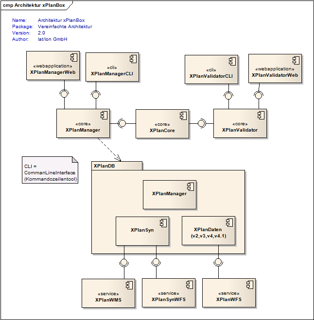
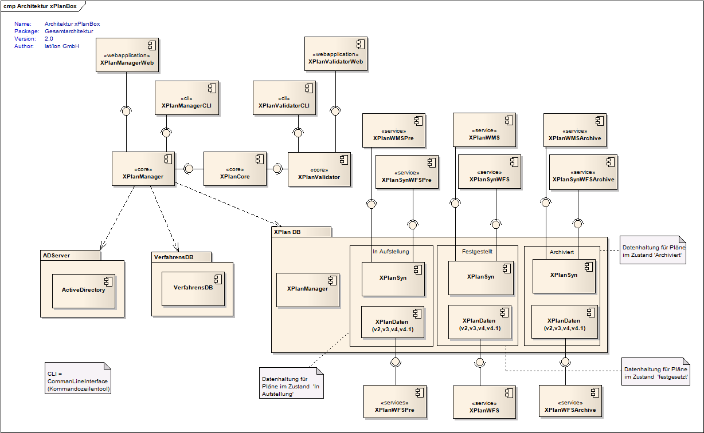

.. _architecture:

Systemarchitektur und Schnittstellen
====================================

Das Gesamtsystem setzt sich aus folgenden Komponenten zusammen:

 * XPlanManager CLI
 * XPlanManager Web
 * XPlanValidator CLI
 * XPlanValidator Web
 * XPlanPortal
 * XPlanWMS
 * XPlanWFS
 * XPlanSynWFS
 * XPlanResources

Abbildung 1: Einfache Datenhaltung

Abbildung 2: Seperate Datenhaltung

================
XPlanManager CLI
================
Die Komponente XPlanManager CLI ist ein Kommandozeilenwerkzeug, welches dem Fachadministrator des XPlanung Infrastrukturknotens ermöglicht, die Datenhaltung zu kontrollieren.

================
XPlanManager Web
================
Die Komponente XPlanManager Web ist eine Web-Oberfläche, die dem Fachadministrator des XPlanung Infrastrukturknotens ermöglicht, die Datenhaltung zu kontrollieren. Die Web-Oberfläche ist auf dem Kommandozeilenwerkzeug aufgebaut.

==================
XPlanValidator CLI
==================
Die Komponente XPlanValidator CLI ist ein Kommandozeilenwerkzeug, welches dem Fachadministrator des XPlanung Infrastrukturknotens ermöglicht, XPlanGML Instanzdokumente vor dem Import zu validieren.

==================
XPlanValidator Web
==================
Die Komponente XPlanValidator Web ist eine Web-Oberfläche, welche dem Fachadministrator des XPlanung Infrastrukturknotens ermöglicht, XPlanGML Instanzdokumente zu validieren. Der XPlanValidator Web ist auf dem Kommandozeilenwerkzeug aufgebaut.

===========
XPlanPortal
===========
Die Komponente XPlanPortal dient als zentrale Anlaufstelle zur Information und Recherche der bereitgestellten Planwerke.

========
XPlanWMS
========
Der XPlanWMS (xplan-wms) ist ein auf dem Standard Web Map Service (Version 1.1.1 und 1.3.0) des Open Geospatial Consortium (OGC) basierender Kartendienst. Dieser bietet die Möglichkeit, Visualisierungen von Plandaten sowie Sachinformationsabfragen zu einzelnen Planinhalten abzufragen.
Um diese Plandaten zu visualisieren bzw. Sachinformationen abzufragen ist es möglich, sowohl eine einfache (siehe Abbildung 1) als auch eine seperate Datenhaltung (siehe Abbildung 2) zu benutzen, in der die Plandaten hinterlegt sind.
Dabei wird bei einer seperaten Datenhaltung (In Aufstellung, Festgestellt, Archiviert) durch die Auswahl des Planstatus, die dazugehörige  Datenhaltung und somit der entsprechende XPlanWMS-Endpoint angesprochen.

 * XPlanWMS ==> Festgestellt
 * XPlanWMSpre ==> In Aufstellung
 * XPlanWMSArchive ==> Archiviert

.. hint:: Gleiches gilt für den XPlanWFS bzw. XPlanSynWFS

========
XPlanWFS
========
Der XPlanWFS (xplan-wfs) ist ein auf dem Standard Web Feature Service (Version 1.1.0 und 2.0.0) des Open Geospatial Consortium (OGC) basierender Dienst zur Abfrage von Vektordaten.

===========
XPlanSynWFS
===========
Der XPlanSynWFS (xplansyn-wfs) dient der Abbildung des synthetisierten XPlanung GML Anwendungsschemas (XPlanSynGML). Dieses stellt eine vereinfachte und zusammenfassende Form der verschiedenen XPlanGML Versionen dar.

==============
XPlanResources
==============
Die optionale Komponente XPlanResources (xplan-root) bietet eine Einstiegsseite zu den einzelnen Komponenten der XPlanBox an und stellt verschiedene Dokumente bereit.